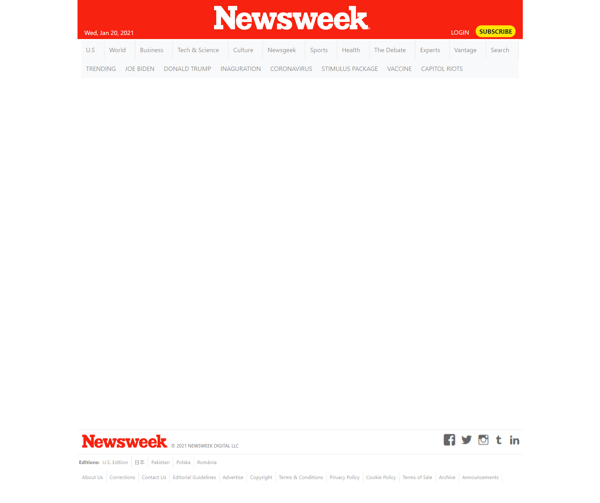

# Project Name: Newsweek - Clone

## Week 3 Collaborative Project

Beaufitul responsive and mobile first web-page design is the future. With mobile devices and multiple size and input devices dominating and growing exponentially, this is going to be the front-end revolution.

Skills Revived & Learned:

- Versioning & best coding practices, Github Flow.
- HTML5, CSS3 elements, semantics, features etc.
- Cloning - the hard work and skills needed to successfully make a clone.
- Linter - install & fix errors
- Collaborative learning, being patient, helping each other succeed.
- Attending Daily standup, being focused, accountable.

> Learning Goals:

- Version Control, Github Flow
- Introduction to HTML5, CSS3, Bootstrap.
- Position, Flex, Grid, Floats, RWD

## Built With

- Major languages: HTML5, CSS3
- Frameworks: Bootstrap, Github flow, Mobile First Approach
- Technologies used: Responsive Web Design

## Live Demo

[Live Demo Link](https://smy5152.github.io/newsweek-clone-wk3/)

## Authors

👤 **Shabbir**

- GitHub: [@smy5152](https://github.com/smy5152)
- Twitter: [@smy5152](https://twitter.com/smy5152)
- LinkedIn: [Shabbir Yamani](https://www.linkedin.com/in/shabbirmyamani/)

👤 **Andres Leon**

- GitHub: [@notrexxx](https://github.com/notrexxx)
- Twitter: [@emigdioleon1](https://twitter.com/emigdioleon1)
- LinkedIn: [Emigdio Leon](https://linkedin.com/emigdio-leon-689109195)

## Show your support

Give a ⭐️ if you like this project!

## Acknowledgments

- Hat tip to anyone whose code was used
- Inspiration
- Learning

## 📝 License

This project is [MIT](./LICENSE) licensed.
